<p align="center">
  
</p>

<h1 align="center">F0RG3-W1R3</h1>

<p align="center"><strong>one config · every platform · branded installers</strong></p>

<p align="center">
  <a href="#"></a>
  <a href="#license"></a>
  <a href="#"></a>
  <a href="#"></a>
  <a href="#ip-safety-boundary"></a>
</p>

---

**F0RG3-W1R3 is a reusable, config-driven installer framework for Itasha.Corp applications.** One shared template plus a small per-app override produces branded, signed installers for Windows (NSIS), macOS (`.dmg`), and Linux (AppImage + `.deb`) from an app's **compiled binary** — never its source.

It packages an already-built executable into a first-class branded install experience: a Windows options screen with sensible defaults, a drag-to-Applications `.dmg`, a portable Linux AppImage, clean uninstall, and a documented signing posture — without forking a generator per app and without ever putting source code or signing keys in this repository.

> The name is a nod to the *wired* of the Itasha.Corp surface: F0RG3-W1R3 **forges** an installer from a binary and **wires** it onto every platform. Its first consumer is the **C0PL4ND** terminal.

---

## Why F0RG3-W1R3

Shipping a desktop app means three different installer toolchains, three signing stories, and a per-app pile of packaging scripts that drift. F0RG3-W1R3 collapses that into one config.

- **One config, every platform.** A shared `packager.template.toml` of company defaults + a ~15–20 line per-app override → NSIS / `.dmg` / AppImage / `.deb`. Adding a new app is a small override, not a fork.
- **Branded, not generic.** A Windows options screen (Start Menu ✓ / Desktop ☐ / Launch ✓), brand wizard art, a brand `.dmg` background, ARP metadata that kills "can't find the app."
- **Binary-as-artifact, never-vendor-source.** The framework consumes a compiled binary as a build input. There is no app `src/` in this repo — by construction and by audit.
- **Honest signing.** Windows OV (cloud HSM) and macOS Developer ID notarization are real dependencies. Until credentials exist, builds ship unsigned dev-only with a documented warning — notarization is **never faked**.
- **Public-repo safe.** No app source, no signing keys, no internal paths, no secrets. A content-safety audit enforces the boundary in CI.
- **Open and free.** Dual-licensed MIT OR Apache-2.0. Engine is the OSS [cargo-packager](https://github.com/crabnebula-dev/cargo-packager) (pinned `0.11.8`).

---

## Features

- **Cross-platform from one config** — Windows NSIS, macOS `.dmg`, Linux AppImage + `.deb` from a single shared template.
- **Branded Windows installer** — per-machine install to `C:\Program Files\Itasha.Corp\<App>`, an options screen with the exact defaults **[Start Menu ✓] [Desktop ☐] [Launch ✓]**, an opt-in *Add to PATH*, user-selectable install directory, ARP `InstallLocation` + `DisplayIcon`.
- **Reserved enterprise MSI track** — a preserved WiX v6 MSI for Group Policy / Intune managed deployment, alongside the primary NSIS installer (not dropped).
- **Branded macOS `.dmg`** — custom background + drag-to-Applications, with a sign → notarize → staple pipeline (Gatekeeper-offline-ready).
- **Linux menu integration** — valid `.desktop` entry (`Categories=System;Utility;TerminalEmulator;`) + 256px hicolor icon + one-line `install.sh`.
- **Reusable** — per-app override + shared defaults; C0PL4ND is the reference consumer.
- **Local-first & private** — the installer does not phone home; no telemetry.
- **Supply-chain hardened** — pinned tool versions, SHA-pinned third-party Actions, `checksum.sha256` on artifacts.

---

## Layout

```
itasha-installer/
├── .github/assets/                # README banner + footer SVGs
├── packager.template.toml         # SHARED company defaults (engine config)
├── apps/c0pl4nd.toml              # per-app override (first consumer)
├── packaging/
│   ├── windows/options.nsh        # NSIS hook: options screen + ARP + PATH
│   ├── windows/wix/               # RESERVED enterprise MSI track (WiX v6)
│   ├── macos/                     # dmg layout + sign/notarize/staple
│   └── linux/                     # .desktop + AppImage/.deb + install.sh
├── branding/                      # SVG sources + gen-assets.sh (icons, wizard art)
├── scripts/build.sh, build.ps1    # build wrappers (invoke cargo-packager)
├── docs/binary-input-contract.md  # how a compiled binary is consumed
├── docs/adr/                      # engine + reserved-MSI + signing ADRs
├── tests/                         # config validation + content-safety audit
└── ships-publicly-vs-never.md     # the IP-safety boundary checklist
```

---

## Quick start (maintainers)

```sh
# 1. Validate the config (no external tools required):
python tests/validate_config.py packager.template.toml apps/c0pl4nd.toml

# 2. Dry-run the merge + resolve the install dir (no cargo-packager needed):
./scripts/build.sh --app c0pl4nd --dry-run

# 3. Build a real installer (requires cargo-packager + a compiled binary):
cargo install cargo-packager --version 0.11.8 --locked
./scripts/build.sh --app c0pl4nd --binary /path/to/c0pl4nd
```

If `cargo-packager` is not installed, the build wrappers print the exact install command and exit non-zero — they never report a false success.

---

## How to add a new app

1. Copy `apps/c0pl4nd.toml` to `apps/<yourapp>.toml`.
2. Set `product_name`, `identifier` (reverse-DNS), `install_subdir`, `binary`, the `icon_*` paths, and the target `formats`.
3. Add the app's brand: `branding/<yourapp>/icon.svg`, then `./branding/gen-assets.sh --app <yourapp>` to produce the per-OS icons + wizard art.
4. Validate: `python tests/validate_config.py apps/<yourapp>.toml`.

The shared template supplies every company default — you override only what differs. The resolved Windows install directory is `<windows_install_root>\<install_subdir>` — e.g. C0PL4ND installs per-machine to `C:\Program Files\Itasha.Corp\C0PL4ND`.

---

## Per-OS install (for end users of a packaged app)

The packaged apps ship to managed package managers. The three one-liners for
the first consumer, **C0PL4ND**, are:

```sh
winget install ItashaCorp.C0PL4ND                                          # Windows
brew install --cask itasha-corp/tap/c0pl4nd                                # macOS
scoop bucket add itasha-corp https://github.com/itasha-corp/scoop-bucket   # Windows (one-time)
scoop install itasha-corp/c0pl4nd
```

A published release auto-opens the winget / Homebrew bump PRs and self-bumps
the Scoop manifest — the package-manager hash is always computed from the
signed asset, never hand-typed (see `packaging/manifests/README.md`).

### Windows

`winget install ItashaCorp.C0PL4ND`, or download `<app>-<version>-x86_64-setup.exe` from the app's Releases page and run it. It installs per-machine under *Program Files*, creates a Start Menu entry, and (optionally) launches the app. An enterprise `.msi` is also available for Group Policy / Intune deployment. Scoop (per-user) is an alternative: `scoop bucket add itasha-corp https://github.com/itasha-corp/scoop-bucket && scoop install itasha-corp/c0pl4nd`.

### macOS

`brew install --cask itasha-corp/tap/c0pl4nd` (installs `C0PL4ND.app` into */Applications*), or open the `<app>-<version>.dmg` and drag the app to *Applications*. Signed + notarized builds pass Gatekeeper offline; unsigned dev builds run after a right-click → Open.

### Linux

Download the AppImage, make it executable, and run it — or use the installer script:

```bash
chmod +x <App>-*.AppImage && ./<App>-*.AppImage
# or:  ./packaging/linux/install.sh --appimage ./<App>.AppImage
```

A `.deb` is also published for APT-based distros.

---

## How signing works (free tiers wired; paid certs optional)

The framework signs **as much as is free**, then lets a paid cert remove the
OS first-run warning later with no code change. Three free tiers ship wired:

- **minisign (all platforms, free, no CA)** — every release artifact gets a
  detached `<artifact>.minisig`. Anyone verifies it offline against the
  published `keys/minisign.pub` with `scripts/verify.sh` / `verify.ps1`.
  One-time setup: `scripts/gen-minisign-key.sh` (commit the public key, store
  the secret as the `MINISIGN_SECRET_KEY` CI secret).
- **Windows self-signed Authenticode (free)** — `scripts/gen-selfsigned-cert.ps1`
  gives the installer a stable publisher identity that enterprises can
  allow-list via Group Policy/Intune (import the exported `.cer`). General
  users still see a one-time SmartScreen warning until a paid cert exists.
- **macOS ad-hoc (free)** — `.app` bundles are ad-hoc-signed for local
  integrity. Downloaded ad-hoc apps still need a right-click → *Open* until
  notarized.

**Paid upgrade (optional, removes the warning):**

- **Windows:** an OV code-signing certificate in a cloud HSM. (EV no longer instantly clears SmartScreen; reputation builds from a stable signing identity.)
- **macOS:** an Apple Developer Program account ($99/yr) for Developer ID signing + notarization + stapling — the only path that clears Gatekeeper for public distribution.

Signing is **gated on credential presence and never faked**: when a credential is absent, that tier is skipped with a loud notice and the artifact ships honestly unsigned-but-minisigned. All secrets are referenced **by name** from CI secrets — never written to this repository. Full tier ladder: [`docs/adr/0003-signing-posture.md`](docs/adr/0003-signing-posture.md).

### Verifying a download (free, offline)

```sh
# Linux/macOS
./scripts/verify.sh <artifact>            # sha256 + minisign
# Windows
./scripts/verify.ps1 -Artifact <artifact> # sha256 + minisign + Authenticode status
```

### "Why is there a SmartScreen / Gatekeeper warning?"

A brand-new signing identity has no reputation yet, so Windows SmartScreen may warn on first download, and macOS Gatekeeper blocks unsigned apps outright.

- **Windows:** on the SmartScreen prompt choose *More info → Run anyway*. Reputation accrues as more users install the signed build; it is not bought with an EV cert anymore (a 2024 policy change).
- **macOS:** signed + notarized + stapled builds pass silently and offline. An unsigned dev build runs after a right-click → *Open* → *Open*.

---

## IP-safety boundary

This framework is structured to live in its own **public** repository. Read [`ships-publicly-vs-never.md`](./ships-publicly-vs-never.md): no app source, no signing keys, no secrets, no internal paths — binaries are consumed as release artifacts. The `tests/content_safety_audit.py` script enforces this and runs in CI; a PR that fails it cannot merge.

---

## Contributing

See [`CONTRIBUTING.md`](./CONTRIBUTING.md) for the development setup, the "add a new app" walkthrough, and the local-check workflow. Found a security issue? Follow [`SECURITY.md`](./SECURITY.md) — do not open a public issue for vulnerabilities or, especially, for any secret you find leaked.

---

## License

Dual-licensed under either of:

- **MIT License** ([LICENSE-MIT](LICENSE-MIT))
- **Apache License, Version 2.0** ([LICENSE-APACHE](LICENSE-APACHE))

at your option. Contributions are dual-licensed as above without additional terms.

---

<p align="center">
  
</p>
